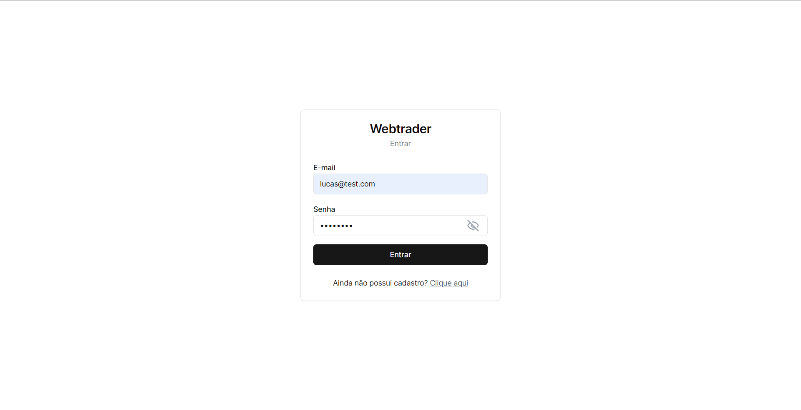
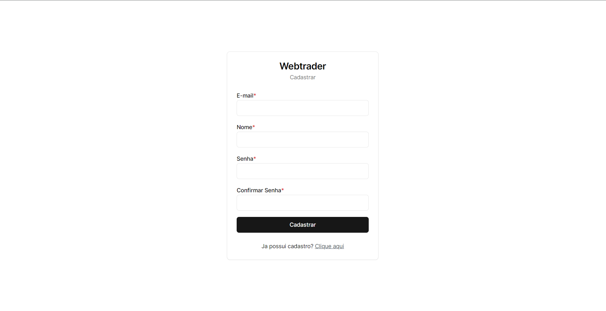
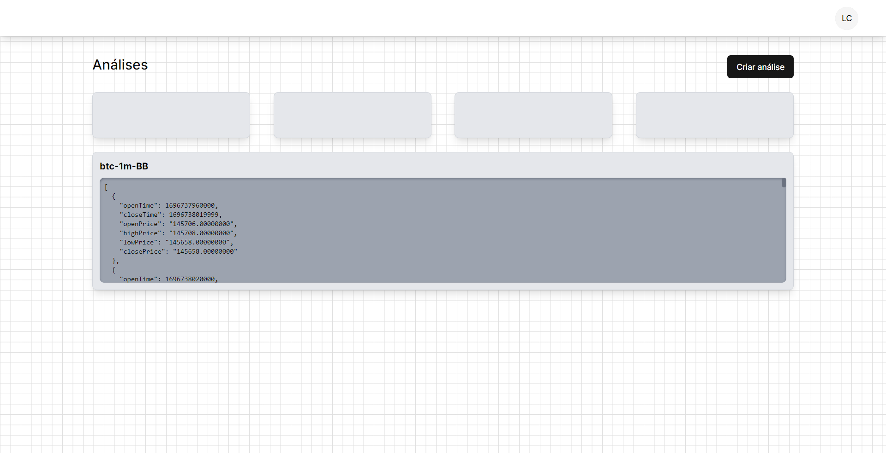
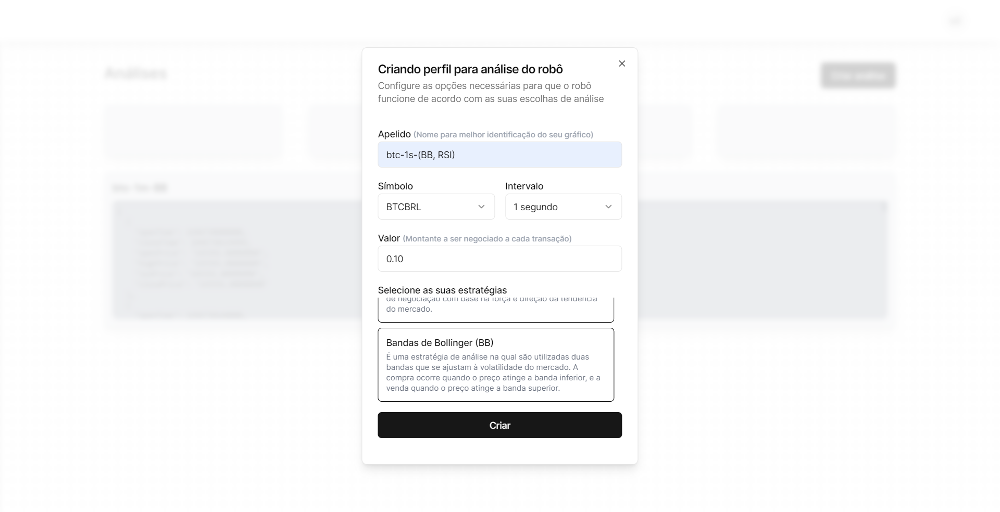
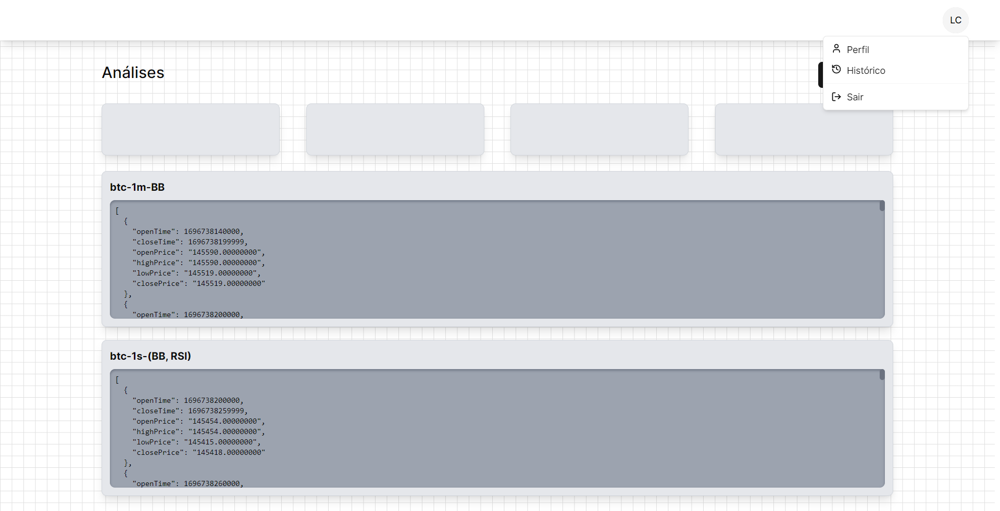

# Web Trader Frontend

## Casos de uso

- Usuário pode se cadastrar na plataforma
- Usuário pode entrar na plataforma
- Usuário pode retornar à plataforma sem que seja necessário entrar novamente
- Usuário pode cadastrar a chave de API da binance para que seja realizada a execução das ordens na corretora
- Usuário pode atualizar a chave de API
- Usuário pode criar um perfil do robô ajustando qual a moeda ele deseja analisar, e qual o intervalo de cada candle
- Usuário pode visualizar o gráfico da moeda
- Usuário pode ver as ações tomadas pelo robô na interface
- Usuário pode ver o histórico de ordens dos robôs
- Usuário pode atualizar as informações do perfil
- Usuário pode visualizar as informações do perfil

## Interfaces

- Login 
- Register 
- Dashboard 
- Bot Creation 
- Interactions 

---

# Organizações Internas

## Fluxo da analise dos dados (Usuário cria um novo perfil):

- [x] Fazer requisição para o backend salvando os dados do novo perfil do robo
- [x] Fazer requisição para coletar os novos dados para analise (1000 dados)
- [x] Conectar com o websocket para ler os dados que chegarem
- [x] A cada novo dado, é feita uma analise
- [x] A partir da analise é tomada uma decisão de compra ou venda

## Outros Fluxos

- [x] Registrar a chave de api no banco de dados

  - colocar campo na tabela de usuarios de (binance-api-key)✅
  - fazer rota na qual insere a chave✅
  - fazer rota na qual exclui a chave (?)✅
  - fazer verificação se possui chave de api antes de criar um robo✅
  - fazer verificação se possui robos antes de excluir a chave de api✅

- [x] Excluir perfil de robo

  - Fazer rota na qual exclui o perfil do robo a partir do id✅
  - Fazer botão no frontend no qual exclui✅

- [ ] Processamento da ordem

  - Rota para processamento da ordem
  - usecase para inserir na fila de ordens
  - usecase para processar a ordem no broker, atualizar a versão do usuário e inserir na tabela de histórico de ordens

- [ ] Historico de ordens com paginação

  - criar tabela no banco de historico de ordens✅
  - criar rota que retorna historico de ordens✅
  - criar paginação das ordens
  - criar paginação das ordens no front

- [ ] Atualizar informações do usuario (Nome, senha)

  - Fazer rota PUT na qual atualiza as informações do usuário
  - Fazer formulário no frontend com nome, redefinir senha✅

- [ ] Stop Loss, Stop Gain

- [x] Inserir biblioteca de gráfico para a visualização dos dados✅

- [ ] Adição de informações sobre a carteira do usuário [DEPRECATED]

- [ ] Esqueceu a senha(????)
